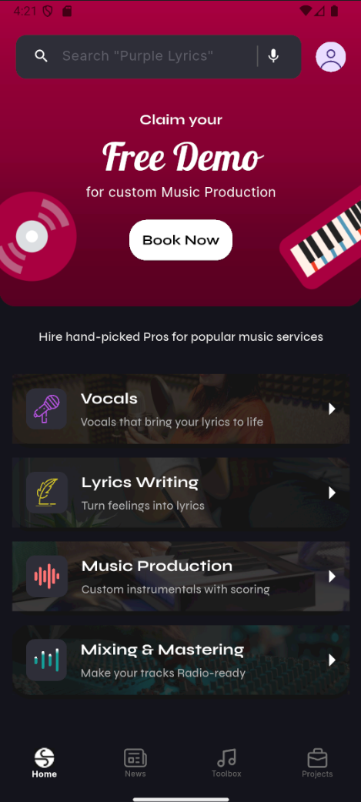
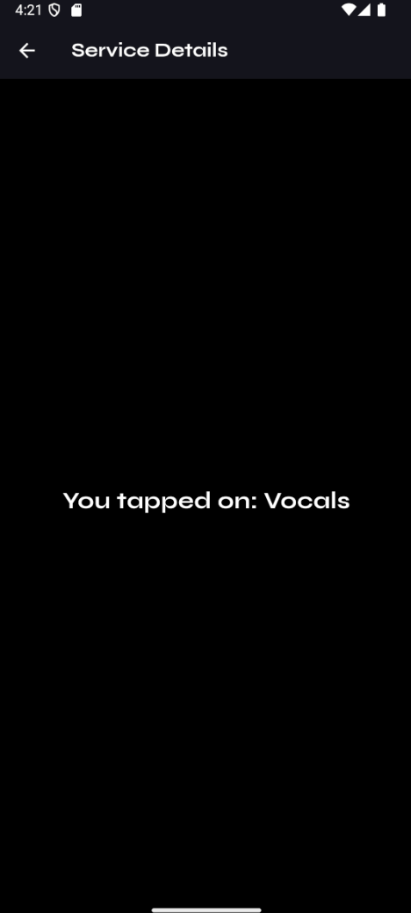

# S.Rocks Music App 🎵

> A Flutter music service app with Firebase integration, Provider state management, and MVVM architecture.
🎥 [Watch Demo Video](https://drive.google.com/file/d/1ArksgqDeNrmOmmZkfdfIs6z6TIPWs3fH/view?usp=sharing)
## 📸 Screenshots

### Home Screen


### Edit Screen

---

## 🛠️ Technologies & Tools

- Flutter & Dart  
- Firebase Firestore  
- Provider (State Management)  
- get_it (Dependency Injection)  
- Flutter ScreenUtil (Responsive Design)  
- Google Fonts  
- go_router
- flutter_svg

---

## 🚀 Features

- Responsive UI based on Figma design  
- Fetch music services dynamically from Firestore  
- Bottom navigation with smooth transitions  
- Clean MVVM architecture  
- State management with Provider  
- Dependency injection using get_it  

---

## ⚙️ Setup Instructions

```bash
git clone https://github.com/Mohamedmh3/srocks_music_app.git
cd srocks_music_app
flutter pub get
flutter run
Make sure to configure Firebase by adding your own google-services.json or GoogleService-Info.plist. Alternatively, use the provided firebase_options.dart file.

📦 Project Structure
lib/
├── features/
│   └── home_page/
│       ├── models/
│       │   └── service.dart
│       ├── repositories/
│       │   └── service_repository.dart
│       ├── viewmodels/
│       │   ├── home_navigation_viewmodel.dart
│       │   └── home_viewmodel.dart
│       └── views/
│           ├── home_screen.dart       
│           ├── detail_screen.dart    
│           └── widgets/
│               ├── custom_bottom_nav_bar.dart
│               ├── custom_button.dart
│               ├── input_text_form.dart
│               └── service_card.dart
├── src/
│   ├── components/
│   │   └── svg_icon_widget.dart
│   ├── di/
│   │   └── locator.dart
│   ├── routing/
│   │   ├── router.dart
│   │   └── routes.dart
│   ├── theme/
│   │   ├── app_icons.dart
│   │   └── app_images.dart
│   └── utils/
│       ├── extensions.dart
│       └── firebase_options.dart
└── main.dart
💡 Using Provider & get_it

📝 License
MIT © Mohammad Mohammad

Developed with ❤️ by Mohammad Mohammad

